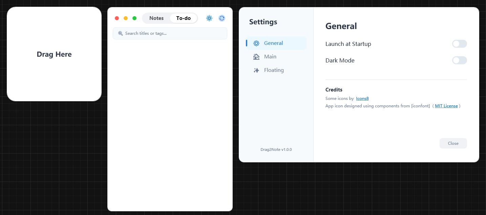
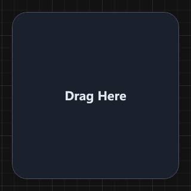
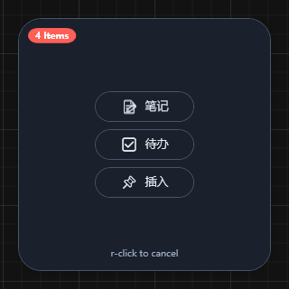
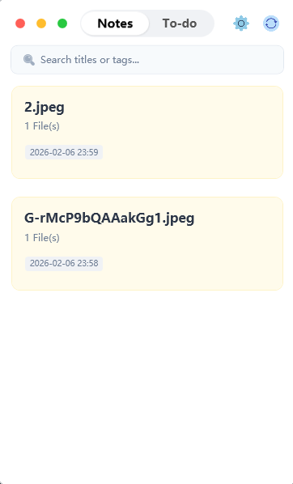
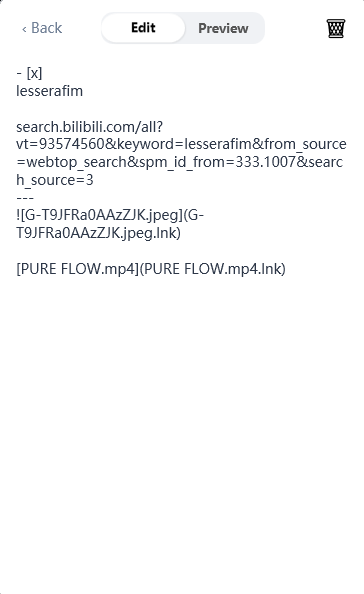
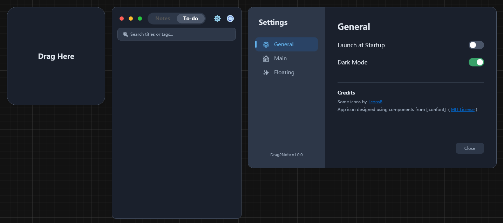
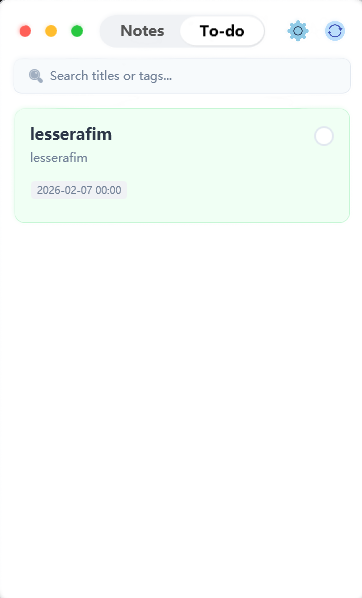
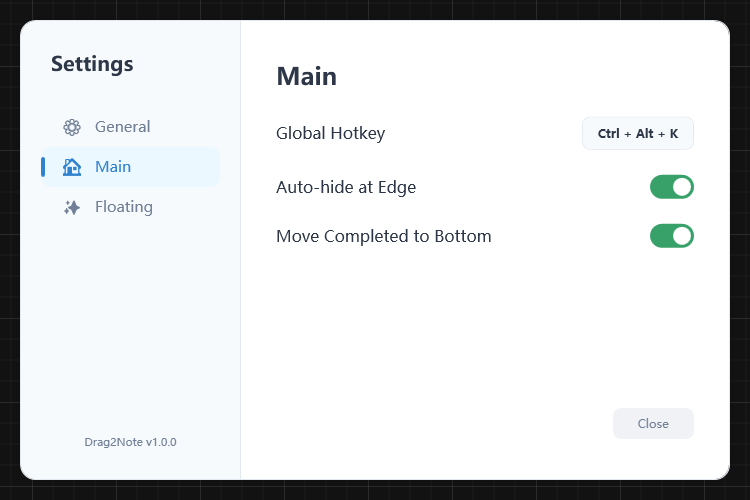
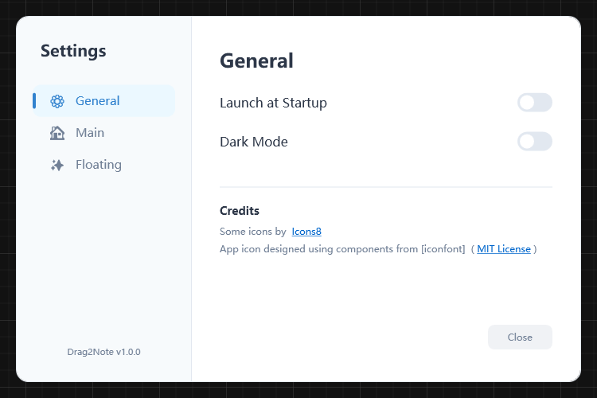
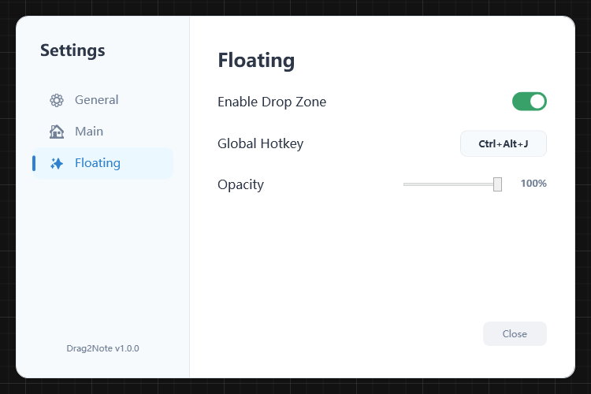

# Drag2Note-Lite

> **A Lightweight, "Drag-First" Desktop Note-Taking App for Windows.**
>
> 🌐 **[简体中文 (Simplified Chinese)](README-CN.md)**

Drag2Note-Lite is a minimal yet powerful productivity tool designed to capture information as fast as you can think. By dragging text, images, or files onto a floating drop zone, you can instantly turn transient thoughts into structured, searchable notes.

<p align="center">
  
</p>

## 🌟 Why Drag2Note-Lite?

In a world of bloated, cloud-dependent note apps, Drag2Note-Lite stands out by focusing on:
1.  **Speed**: Zero-latency startup and instant capture via global hotkeys.
2.  **Privacy**: 100% Request-free. Your data lives on your disk, not our servers.
3.  **Aesthetics**: A meticulously crafted WPF UI that feels native yet premium.
4.  **Lightweight**: Optimized performance with minimal footprint (~50MB RAM).

---

## ✨ Key Features

### 🖱️ Advanced Drag & Drop Workflow
> **Drag any content to the floating ball to capture instantly.**

<table align="center" border="0">
  <tr>
    <td align="center" valign="middle">
      
    </td>
    <td align="center" valign="middle">
      
    </td>
  </tr>
</table>

We've engineered a **Hybrid Drag Engine** that combines the best of both worlds:
- **Card Reordering**: Powered by `GongSolutions.WPF.DragDrop` for smooth, animated list sorting with ghost adorners.
- **Tag Management**: Custom native implementation allow you to drag tags *within* draggable cards without conflicts.
- **File Capture**: Drag any file onto the floating ball to create a note. Images are auto-previewed; text files are parsed.

### 🏷️ Smart & Fluid Tagging
<p align="center">
  
  
</p>

- **Auto-Date Tags**: Automatically tags new notes with `YYYY-MM-DD`.
- **Drag-to-Sort**: Reorder tags just like you reorder notes.
- **Inline Editing**: Double-click any tag to rename it.

### 🎨 Adaptive UI / UX
<p align="center">
  
</p>

- **True Dark Mode**: The UI (including hover states, specialized buttons, and text contrast) adapts perfectly to your system theme.
- **Refined Interactions**: 
  - **Capsule Toggles**: Smooth transitions between "Notes/Todo" and "Edit/Preview".
  - **Rounded Controls**: Custom `ControlTemplates` for buttons ensures every click feels tactile.

<p align="center">
  
  
</p>

### ⚙️ Powerful Settings
<p align="center">
  
  
  
</p>

### 🛠️ Developer-First Architecture
- **Clean MVVM**: Built on `CommunityToolkit.Mvvm` for a separation of concerns.
- **Local-First JSON**: Data is stored in a human-readable `metadata.json` and standard Markdown files.
- **Build It Yourself**: No proprietary magic. Requires .NET 8.0 SDK.

---

## 🚀 Getting Started

### Installation
1.  Go to the [Releases](https://github.com/lesserafim4ever0502/Drag2Note-Lite/releases) page.
2.  Download `Drag2Note-Lite_Setup.exe` (or the portable `.zip`).
3.  Run the application.

### Basic Usage
- **Global Hotkey**: Press `Ctrl + Alt + Q` to toggle the main dashboard.
- **Capture**: Drag a file onto the floating ball (bottom right of screen).
- **Edit**: Click a card to enter "Editor Mode".
- **Preview**: Toggle the "Eye" icon to render Markdown.

---

## 🛠 Technology Stack

This project works because of these amazing open-source technologies:

| Category | Technology | Purpose |
| :--- | :--- | :--- |
| **Core** | .NET 8.0 (C# 12) | High-performance runtime. |
| **UI Framework** | WPF (Windows Presentation Foundation) | Hardware-accelerated desktop UI. |
| **Architecture** | MVVM (CommunityToolkit) | Clean code structure and binding. |
| **Drag & Drop** | GongSolutions.WPF.DragDrop | Complex drag interactions. |
| **Input** | NHotkey.Wpf | Global keyboard hooks. |
| **System** | Hardcodet.NotifyIcon | System tray integration. |

---

## 📂 Project Structure

For a detailed breakdown of the codebase, please refer to our **[Code Map (CODEMAP.md)](CODEMAP.md)**.

```
Drag2Note/
├── Views/              # XAML UI Definitions
├── ViewModels/         # Application Logic
├── Models/             # Data Structures
├── Services/           # File I/O & Business Logic
└── UserData/           # Your Notes (Local Storage)
```

---

## 🤝 Contributing

Contributions are welcome!
1.  Fork the repository.
2.  Create a feature branch (`git checkout -b feature/amazing-feature`).
3.  Commit your changes (`git commit -m 'Add amazing feature'`).
4.  Push to the branch.
5.  Open a Pull Request.

---

## 📄 License

Distributed under the MIT License. See `LICENSE` for more information.

## 🙏 Acknowledgements

- **GongSolutions** for the incredible drag-drop library.
- **Microsoft** for the modern .NET ecosystem.
- **Icons8** for the visual assets.
